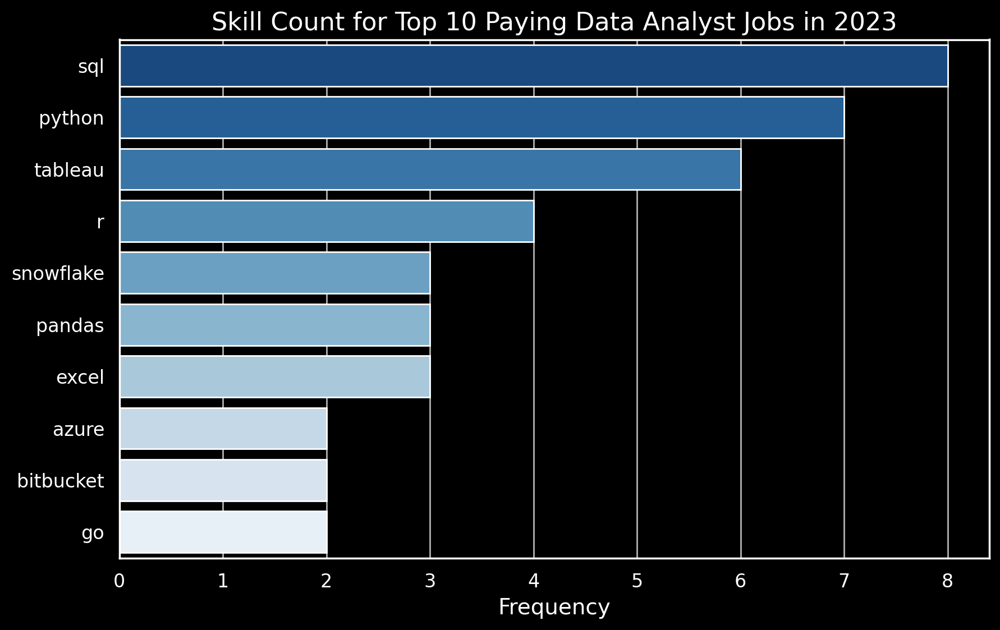

# 🚀 Data Analyst Job Market Exploration

Welcome to my deep dive into the **data analyst job market**! This project is a comprehensive analysis of 💰 **top-paying roles**, 🔥 **in-demand skills**, and 📈 **optimal skill sets** to thrive in the field of data analytics. Through SQL-powered insights, I’ve uncovered trends that can help aspiring data analysts navigate their career paths effectively.

---

## 📖 Project Overview

This project was born out of a desire to answer key questions about the data analyst job market:

1. **What are the top-paying data analyst jobs?**
2. **What skills are required for these roles?**
3. **Which skills are most in demand?**
4. **What skills are associated with higher salaries?**
5. **What are the most optimal skills to learn?**

By leveraging SQL and other tools, I’ve transformed raw data into actionable insights, helping others streamline their job search and skill development.

---

## 🛠️ Tools & Technologies

Here’s a snapshot of the tools I used to power this analysis:

- **SQL**: The backbone of my analysis, enabling me to query and extract meaningful insights.
- **PostgreSQL**: My database management system of choice for handling job market data.
- **Visual Studio Code**: My go-to IDE for writing and executing SQL queries.
- **Git & GitHub**: Essential for version control and sharing my work with the community.

---

## 🔍 Key Findings

### 1️⃣ Top-Paying Data Analyst Jobs
Using SQL, I identified the highest-paying remote data analyst roles. Here’s a sneak peek:

- **Salary Range**: $184,000 to $650,000 annually.
- **Top Employers**: Companies like Meta, AT&T, and SmartAsset.
- **Job Diversity**: Roles range from Data Analyst to Director of Analytics.

### 2️⃣ Skills for Top-Paying Jobs
What skills do high-paying jobs demand? My analysis revealed:

- **SQL**: Required in 8 out of 10 top-paying roles.
- **Python**: A close second, appearing in 7 roles.
- **Tableau**: Highly sought after, featured in 6 roles.

### 3️⃣ Most In-Demand Skills
Which skills are most frequently requested in job postings? Here’s the top 5:

| Skill      | Demand Count |
|------------|--------------|
| SQL        | 7,291        |
| Excel      | 4,611        |
| Python     | 4,330        |
| Tableau    | 3,745        |
| Power BI   | 2,609        |

### 4️⃣ Skills with Higher Salaries
Some skills command higher salaries than others. Here’s a glimpse:

| Skill          | Average Salary ($) |
|-----------------|-------------------:|
| PySpark         | 208,172           |
| Couchbase       | 160,515           |
| DataRobot       | 155,486           |
| Pandas          | 151,821           |
| Elasticsearch   | 145,000           |

### 5️⃣ Most Optimal Skills to Learn
Combining demand and salary data, I pinpointed the most strategic skills to learn:

| Skill       | Demand Count | Average Salary ($) |
|-------------|--------------|-------------------:|
| Snowflake   | 37           | 112,948           |
| Azure       | 34           | 111,225           |
| AWS         | 32           | 108,317           |
| Tableau     | 230          | 99,288            |
| Python      | 236          | 101,397           |

---

## 🧠 What I Learned

This project was a game-changer for my SQL skills. Here’s what I mastered:

- **Advanced Querying**: Crafting complex SQL queries with `WITH` clauses and joins.
- **Data Aggregation**: Using `GROUP BY`, `COUNT()`, and `AVG()` to summarize data.
- **Real-World Problem Solving**: Translating business questions into actionable SQL queries.

---

## 📊 Visuals & Insights

Throughout the project, I visualized my findings to make the data come alive. From bar graphs to tables, each visualization tells a story about the data analyst job market.

---

## 💡 Key Takeaways

1. **SQL is King**: It’s the most demanded and highly valued skill in the job market.
2. **Specialized Skills Pay Off**: Proficiency in tools like Snowflake, PySpark, and Tableau can significantly boost earning potential.
3. **Cloud & Big Data**: Skills in cloud platforms and big data technologies are increasingly important.
4. **Continuous Learning**: Staying updated with emerging tools and technologies is crucial for career growth.

---

## 🎯 Closing Thoughts

This project not only sharpened my technical skills but also provided valuable insights into the data analyst job market. Whether you’re an aspiring data analyst or a seasoned professional, these findings can guide your career decisions and skill development.

Feel free to explore the SQL queries and analysis in the [project_sql folder](/Project1_sql/). Let’s connect and discuss how we can leverage data to drive impactful decisions!

---

Thank you for taking the time to explore my project! 🚀

---

    

